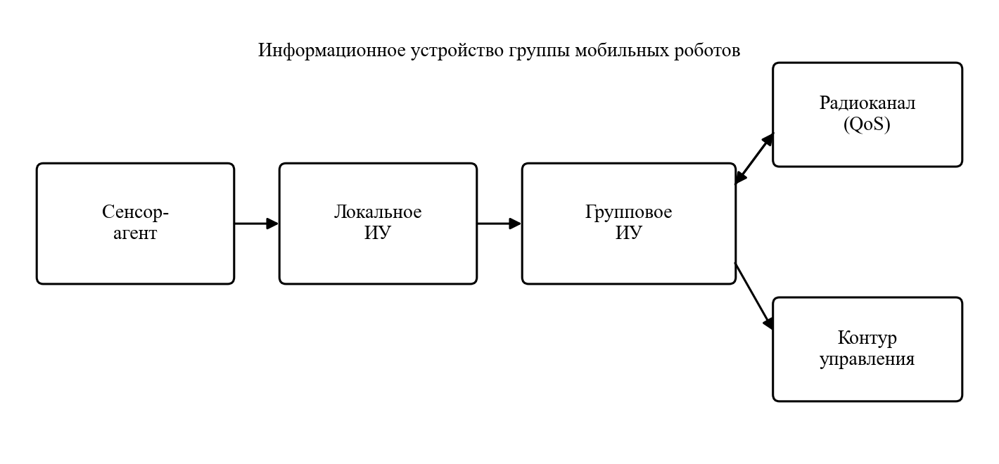
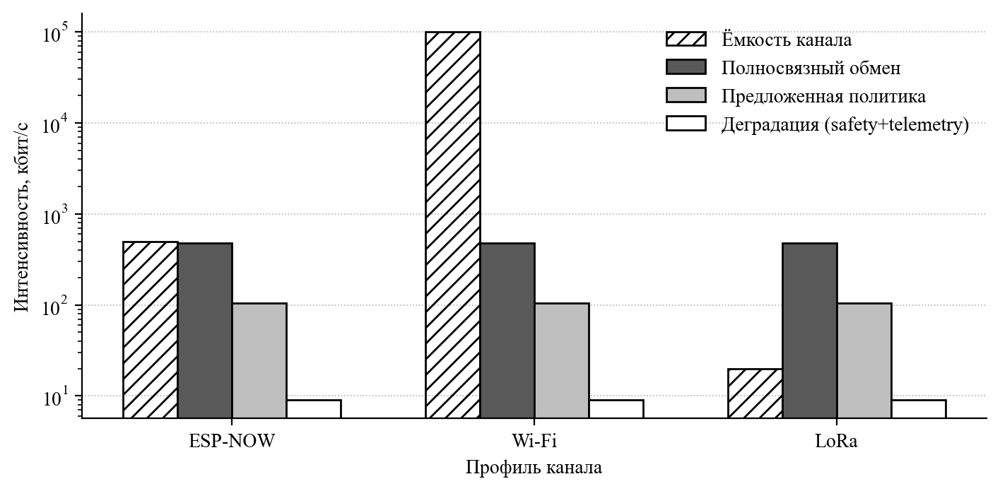

# Многоагентное информационное устройство группы мобильных роботов

**Рабочая тема:** Метод построения многоагентного информационного устройства группы мобильных роботов при ограничениях беспроводного канала обмена сенсорными данными

**Журнал:** Мехатроника, автоматизация, управление (заготовка под ВАК)  
**УДК:** 621.865.8:004.896  
**Файл Word:** [mau_info_device.docx](mau_info_device.docx)

Ф. И. О. автора  
аспирант, author@mephi.ru  
Национальный исследовательский ядерный университет «МИФИ», г. Москва

## Аннотация

Предложен метод построения многоагентного информационного устройства группы мобильных роботов, работающего при ограничениях беспроводного канала обмена сенсорными данными. Известные архитектуры мультиагентных сенсорных систем и группового управления ориентированы на полноту сенсорной модели и распределение заданий, тогда как пропускная способность, задержка и потери пакетов радиоканала обычно принимаются идеализированными. Объектом исследования является информационное устройство распределённой робототехнической системы, предметом — метод его построения, сохраняющий целевые функции группы при ограниченном качестве обслуживания канала. Устройство представлено четырьмя слоями: сенсор-агент, локальное информационное устройство, групповое информационное устройство и сопряжение с контуром управления движением. Формально метод задаёт отображение локальных карт и состояний вместе с профилем канала в множество межроботных сообщений и в оценку, поступающую в контур управления. Сенсорный трафик разделён на классы критичности (безопасность, поза, карта, телеметрия). Предложены политики обмена: приоритезация сообщений, сжатие локальной карты до дельт занятости, слияние чужих данных с метками свежести и доверия, управляемая деградация функций при сжатии канала. Беспроводные технологии заданы профилями канала (задержка, потери, полоса, допустимый масштаб группы), а не сравнительной таблицей «лучшего протокола». Для типовой группы из пяти роботов выполнена модельная оценка интенсивности трафика: полносвязный обмен картами занятости требует порядка 0,48 Мбит/с и не укладывается в узкий канал, тогда как предложенная политика снижает интенсивность примерно до 0,105 Мбит/с и сохраняет классы безопасности и позы. Для дальнего узкого профиля допустим только аварийно-телеметрический режим порядка 9 кбит/с. Тем самым показано, что реализуемость группового информационного устройства определяется политикой обмена, а не выбором «более быстрого» протокола. Сделан вывод о применимости метода к научной специальности 2.5.4. Натурная верификация на стенде в работу не включалась и рассматривается как следующий этап.

**Ключевые слова:** многоагентная система, информационное устройство, мобильный робот, групповое управление, беспроводной канал, сенсорные данные, карта занятости, качество обслуживания, распределённая робототехническая система

## Введение

Группа мобильных роботов решает задачи картирования, мониторинга и совместного маневрирования в среде, где проводной обмен данными между агентами невозможен. Информационное обеспечение такого коллектива включает датчики, алгоритмы обработки измерений и канал передачи результатов другим агентам и контуру управления. Принципы построения информационных устройств робототехнических систем — от кинестетических и локационных датчиков до сопряжения с системой управления — систематизированы в [1]. Для сервисного мобильного робота предложен мультиагентный взгляд на саму сенсорную систему: лазерный сканер и массив ультразвуковых датчиков рассматриваются как агенты, совместно строящие карту в динамической среде [2]. Для коллектива роботов сформулированы принципы мультиагентного управления в задачах коллаборативной робототехники, включая взаимодействие человека с группой и требования безопасности [3]. Модульные алгоритмы распределения заданий, планирования траекторий и обработки данных коллектива развиты в [4, 5].

Параллельно сложился корпус работ по беспроводным сетевым системам управления и по стыку робототехники со связью [6, 7]. Показано, что задержка, джиттер и потери пакетов определяют устойчивость замкнутого контура, а роевые архитектуры предъявляют дополнительные требования к масштабированию обмена [8]. Сравнительные исследования радиотехнологий для мобильных роботов дают численные оценки дальности, полосы и помехоустойчивости Wi-Fi, Bluetooth, ZigBee, LoRa, ESP-NOW и сотовых сетей ультранадёжной связи [9–11]. Эти результаты полезны как ограничения, но не заменяют архитектуры информационного устройства: протокол сам по себе не решает, какие сенсорные данные должны быть переданы, сжаты или отброшены, когда канал уже не несёт полносвязный обмен картами.

Научный пробел состоит в следующем. В [2] сенсоры выступают агентами одного робота, а канал между ними фактически локален. В [3–5] коллектив обменивается заданиями и состояниями при неявном предположении о достаточной связности. В [6, 7, 9] канал изучается как самостоятельный объект, без слоя информационного устройства, согласованного с групповым управлением. Рабочая формулировка метода, развиваемая в статье: метод построения многоагентного информационного устройства группы мобильных роботов при ограничениях беспроводного канала обмена сенсорными данными. Для журнальной рубрики название сжато; существо метода сохраняется.

Цель работы — предложить метод, в котором канал задаётся профилем качества обслуживания, сенсорный трафик разделяется по критичности, а групповое информационное устройство выбирает политику обмена, сохраняющую целевые функции группы. Задачи: формализовать четырёхслойную модель устройства; ввести классы сообщений и политики приоритезации, сжатия, слияния и деградации; задать профили канала по опубликованным оценкам задержки и полосы; выполнить модельную оценку интенсивности трафика для группы из пяти роботов. Натурный эксперимент в работу не включается.

## Постановка задачи

Рассматривается группа из *N* мобильных роботов, совместно строящих карту занятости и выполняющих перемещение в среде с препятствиями. Каждый робот оснащён набором локационных и проприоцептивных датчиков, бортовым вычислителем и приёмопередатчиком. Объект исследования — информационное устройство (ИУ) группы: совокупность сенсорных агентов, локальной обработки, межроботного обмена и интерфейса к контуру управления. Предмет — метод построения ИУ при ограничениях беспроводного канала: конечной пропускной способности *B*, задержке *τ*, вероятности потери пакета *p* и ограниченном числе устойчиво связанных соседей.

Введём вектор состояния *i*-го робота *xi*, локальную карту занятости *Mi* и сообщение *mi,j*, направляемое роботу *j*. Канал задаётся профилем

*Q* = (*B*, *τ*, *p*, *Nmax*)  (1)

где *B* — доступная скорость передачи полезных данных, *τ* — характерная задержка доставки, *p* — вероятность потери пакета, *Nmax* — практический масштаб группы, при котором профиль ещё применим. Требуется построить отображение

*F*: ({*Mi*, *xi*}, *Q*) → {*mi,j*, *ûi*}  (2)

которое формирует множество исходящих сообщений и оценку *ûi*, поступающую в контур управления. Критерий работоспособности группы: при заданном *Q* ошибка совместной карты, риск сближения и доля сорванных заданий не превышают порогов (*εM*, *εc*, *εt*). Иными словами, канал может деградировать, но информационное устройство обязано сузить объём обмена раньше, чем распадётся групповое поведение. Такая постановка соответствует направлениям исследований научной специальности 2.5.4, связанным с обработкой информации в реальном времени, индивидуальным и групповым управлением мобильными роботами и интерфейсами взаимодействия.

Базовые линии, относительно которых оценивается метод: полносвязный обмен полными картами («шлют всё всем») и централизованный сбор карт на выделенном узле. Обе схемы известны в групповом управлении [4, 5] и становятся нереализуемыми, когда *B* меньше суммарной интенсивности сенсорного трафика.

## Модель многоагентного информационного устройства

ИУ предлагается как четырёхслойная конструкция (рис. 1). Слой сенсор-агента продолжает логику [1, 2]: каждый датчик или однородный массив датчиков рассматривается как агент с локальным буфером измерений, периодом опроса и оценкой достоверности. Слой локального ИУ выполняет фильтрацию, построение фрагмента карты и классификацию данных по критичности. Слой группового ИУ выбирает адресатов, сжимает полезную нагрузку и принимает чужие сообщения. Слой сопряжения с управлением передаёт в контур движения только те оценки, свежесть которых достаточна для текущего манёвра, что согласуется с разделением планирования и исполнения в [3–5, 12].

Сенсорный трафик делится на четыре класса. Класс *safety* — факты, непосредственно связанные с предотвращением столкновения (ближняя зона, аварийная остановка). Класс *pose* — оценка положения и ориентации. Класс *map* — фрагменты карты занятости или их дельты. Класс *telemetry* — диагностические и операторские данные, не входящие в контур реального времени. Приоритет убывает в порядке safety → pose → map → telemetry. Такое разделение близко к смешанной критичности обмена в роевых системах и к практике WNCS, где разные потоки требуют разного качества обслуживания [6].

**Таблица 1.** Классы сенсорного трафика группового информационного устройства

| Класс | Содержание | Типовой размер | Период | Адресация |
|---|---|---|---|---|
| safety | Ближняя зона, авария | 32 байт | 50 мс | Широковещание |
| pose | Положение, ориентация | 24 байт | 100 мс | Соседи |
| map | Дельта карты занятости | 200 байт | 500 мс | Соседи |
| telemetry | Диагностика | 64 байт | 1 с | Сток / оператор |

Агент *i* хранит для каждого класса очередь с метками времени. Сообщение снабжается заголовком (идентификатор отправителя, класс, штамп времени *t*, оценка доверия *w*). При приёме карта обновляется правилом слияния: ячейка сетки принимает значение источника с большей свежестью, а при близких штампах — с большим *w*. Устаревшие данные (*tnow* − *t* > *Tclass*) исключаются из контура управления и могут оставаться только в телеметрии. Тем самым канал влияет на ИУ не «обрывом управления», а управляемым сужением сенсорной модели — в духе ситуативного использования информационных устройств [1, 12].

## Метод построения

Метод состоит из пяти шагов, выполняемых при проектировании ИУ и циклически — на борту.

**Шаг 1. Идентификация сенсор-агентов и локального ИУ.** Для выбранной платформы фиксируются типы датчиков, частоты опроса и алгоритмы первичной обработки (локация, одометрия, отбраковка выбросов) в соответствии с [1]. Если на одном роботе совместно работают разнородные локационные средства, они остаются агентами локального ИУ, как в [2], и не транслируются в эфир сырыми выборками.

**Шаг 2. Назначение классов и порогов свежести.** Каждому выходу локального ИУ сопоставляется класс таблицы 1. Порог *Tclass* выбирается из динамики робота: для safety он должен быть меньше времени прохождения ближней зоны, для pose — меньше постоянной времени контура стабилизации, для map — меньше времени существенного изменения сцены.

**Шаг 3. Построение политики обмена под профиль *Q*.** Политика *π(Q)* задаёт: множество адресатов (широковещание, соседи степени *d*, сток); сжатие полезной нагрузки; правило вытеснения из очереди при переполнении канала. Сжатие карты выполняется переходом от полной сетки занятости к дельте: передаются только ячейки, изменившие состояние с прошлого успешного кадра, либо контур занятой области. При росте *p* дельта дополнительно прореживается по значимости (ячейки на траектории соседей имеют приоритет над дальним фоном).

**Шаг 4. Слияние и сопряжение с управлением.** Принятые сообщения обновляют групповую оценку (*M̂i*, *X̂i*). В контур управления передаётся не «последний пакет», а оценка, прошедшая проверку свежести. Если класс safety отсутствует дольше *Tsafety*, включается локально консервативный манёвр (снижение скорости, увеличение дистанции), а не ожидание восстановления канала. Это сохраняет принцип безопасности коллаборативной группы [3] при плохом QoS.

**Шаг 5. Управляемая деградация.** При *B* ниже суммарной интенсивности классов map и pose групповое ИУ последовательно отключает telemetry, уменьшает частоту map, ограничивает pose соседями с *d* = 1…2 и сохраняет safety до последней очереди. На профиле дальнего узкого канала (типичный LoRa) map не используется как поток реального времени: остаётся редкая телеметрия и аварийные команды. Тем самым метод не ищет «лучший протокол», а ставит в соответствие профилю *Q* допустимый набор функций ИУ.

Алгоритм бортового цикла группового ИУ (период *Δt*) имеет вид: собрать выходы локального ИУ; классифицировать; сформировать дельты; оценить текущую ёмкость канала по факту доставки (скользящая оценка *B̂*, *p̂*); упаковать кадры в порядке приоритета, пока не исчерпан бюджет бит *B̂·Δt*; отправить; принять; слить; выдать *ûi* в управление. Оценка канала не требует модели физического уровня конкретного стандарта и поэтому переносима между профилями таблицы 2.

## Профили беспроводного канала

Ниже беспроводные технологии используются только как источники численных ограничений. Значения сведены к четырём параметрам профиля *Q* и к типовому назначению потока. Сводка опирается на обзоры WNCS и экспериментальные сопоставления для мобильных роботов [6, 9–11]. Дальность и энергопотребление учитываются косвенно: они входят в выбор профиля, но не подменяют архитектуру ИУ.

**Таблица 2.** Профили канала обмена сенсорными данными (по опубликованным оценкам)

| Профиль | *B* (порядок) | *τ* | *p* (качественно) | *Nmax* | Допустимые классы |
|---|---|---|---|---|---|
| ESP-NOW / mesh | 0,25–1 Мбит/с | 10–25 мс | низкая–средняя | 10–30 | safety, pose, map |
| Wi-Fi | десятки–сотни Мбит/с | 5–100 мс | растёт с *N* | 5–20 | все классы* |
| ZigBee / 802.15.4 | 250 кбит/с | 15–50 мс | средняя | 50–100 | safety, pose, редкий map |
| BLE 5.x | 0,125–2 Мбит/с | 7–30 мс | низкая | 10–50 | pose, telemetry, safety |
| LoRa | 0,3–50 кбит/с | 0,1–2 с | низкая на дальних | 100+ | telemetry, редкий safety |
| 5G URLLC | 10–100 Мбит/с | 0,8–2 мс** | низкая | 10–100 | замкнутый контур, все классы |

\*Для Wi-Fi задержка и потери растут при увеличении числа станций, поэтому полный набор классов допустим только при ограниченном *N* и дисциплине доступа [10, 11]. \*\*Значение 0,8–2 мс относится к радиоинтерфейсу ультранадёжной связи; сквозная задержка с прикладными протоколами выше [10]. Профиль 5G URLLC в настоящей работе служит верхней оценкой и не используется в численном примере.

Для модельной оценки выбраны три контрастных профиля, доступных лабораторному стенду последующих работ: ESP-NOW как одноранговый обмен группы, Wi-Fi как широкая полоса с риском роста задержки, LoRa как узкий дальний канал. Гибридные связки (команды по узкому каналу, карта по широкому) допускаются методом как два параллельных профиля *Q*, каждый со своим набором классов, что согласуется с многосетевыми схемами управления [11].

## Модельная оценка

Цель расчёта — показать, что политика обмена, а не выбор «более быстрого» протокола, определяет реализуемость ИУ. Рассматривается группа *N* = 5, сценарий совместного картирования помещения 20×20 м. Карта занятости с ячейкой 0,2 м содержит 100×100 = 10 000 клеток. Двоичная занятость даёт 10 000 бит; с служебным заголовком полный кадр карты *Smap* ≈ 1300 байт.

Полносвязный обмен полными картами с частотой *fmap* = 2 Гц создаёт интенсивность

*Rmap* = *N* (*N* − 1) *Smap* *fmap*  (3)

Подстановка значений даёт *Rmap* = 5·4·1300·2 = 52 000 байт/с ≈ 416 кбит/с. Добавление полносвязного обмена позами (24 байт, 10 Гц) и широковещательного safety (32 байт, 20 Гц) повышает суммарную интенсивность примерно до 480 кбит/с. Это величина порядка верхней границы ESP-NOW и заведомо выше практической ёмкости LoRa; для Wi-Fi она мала по полосе, но сохраняет связность all-to-all, чувствительную к росту задержки с *N* [11].

Предложенная политика использует таблицу 1 и соседство степени *d* = 3. Тогда

*Rπ* = *N* [*Ss* *fs* + *d Sp* *fp* + *d SΔ* *fΔ* + *St* *ft*]  (4)

где *Ss*, *Sp*, *SΔ*, *St* — размеры кадров классов safety, pose, дельты карты и телеметрии. При *SΔ* = 200 байт (около 15 % полного кадра карты) получаем *Rπ* = 5·(32·20 + 3·24·10 + 3·200·2 + 64·1) = 13 120 байт/с ≈ 105 кбит/с. Относительно полносвязного обмена выигрыш составляет около 4,6 раза. Интенсивность 105 кбит/с укладывается в профиль ESP-NOW с запасом на служебный трафик канала и не укладывается в типичный LoRa без отключения класса map.

Режим деградации для узкого канала оставляет safety с пониженной частотой (5 Гц) и телеметрию 1 Гц: *Rdeg* ≈ 9 кбит/с. Карта строится только локально, групповое поведение сужается до расхождения по правилам ближней зоны. Это хуже совместного картирования, но сохраняет критерий *εc* (ограничение риска столкновения) при профиле LoRa, который для координации роя в реальном времени непригоден [9]. На профиле Wi-Fi обе политики реализуемы по полосе; смысл метода здесь в том, чтобы не занимать эфир полными картами и тем самым сдерживать рост задержки при увеличении *N*.

Ёмкость на рис. 2 принята как порядок величины полезной скорости: 500 кбит/с для ESP-NOW, 100 Мбит/с для Wi-Fi и 20 кбит/с для LoRa. Это не паспортные пики стандартов, а рабочие оценки, согласованные с [9–11]. Полносвязный обмен превышает ёмкость LoRa более чем на порядок и занимает почти весь бюджет ESP-NOW. Политика *π(Q)* оставляет запас на ESP-NOW и Wi-Fi; для LoRa допустим только режим деградации. Отсюда следует основной модельный вывод: информационное устройство группы должно проектироваться как отображение (2), а не как обёртка над выбранным радиомодулем.

Ограничения оценки. Не моделировались коллизии доступа к среде, пространственная неоднородность *p* и динамика очередей на MAC-уровне. Частоты таблицы 1 — проектные, а не измеренные на конкретной платформе. Размер дельты 200 байт соответствует умеренно разреженной сцене; в коридоре с быстро меняющейся занятостью *SΔ* возрастёт, и запас ESP-NOW сократится. Поэтому численный пример демонстрирует порядок эффекта политики, а не заменяет стендовые измерения ошибки карты и time-to-collision, намеченные как следующая работа.

## Заключение

Предложен метод построения многоагентного информационного устройства группы мобильных роботов при ограничениях беспроводного канала обмена сенсорными данными. Устройство описано четырьмя слоями и четырьмя классами трафика. Канал задан профилем качества обслуживания, а не ранжированием протоколов. Политика обмена включает приоритезацию, сжатие карты до дельт, слияние по свежести и управляемую деградацию. Модельная оценка для пяти роботов показывает снижение интенсивности трафика с примерно 480 кбит/с при полносвязном обмене картами до 105 кбит/с при предложенной политике; узкий дальний канал допускает только аварийно-телеметрический режим.

Результаты применимы при проектировании информационных устройств распределённых робототехнических систем и при обосновании темы аспирантуры по специальности 2.5.4 (обработка информации в реальном времени, групповое управление мобильными роботами, интерфейсы взаимодействия). Дальнейшая работа — натурный стенд из трёх–пяти платформ с профилями ESP-NOW, Wi-Fi и LoRa и измерение ошибки карты, риска сближения и доли выполненных заданий при управляемых потерях пакетов.

## Список литературы

1. Воротников С. А. Информационные устройства робототехнических систем. М.: Изд-во МГТУ им. Н. Э. Баумана, 2005. 384 с.
2. Ермишин К. В., Воротников С. А. Мультиагентная сенсорная система сервисного мобильного робота // Вестник МГТУ им. Н. Э. Баумана. Сер. Приборостроение. 2012. Спец. вып. № 6. С. 50–59. DOI: 10.18698/2308-6033-2012-6-247.
3. Vorotnikov S., Ermishin K., Nazarova A., Yuschenko A. Multi-agent robotic systems in collaborative robotics // Interactive Collaborative Robotics. ICR 2018. Lecture Notes in Computer Science. Cham: Springer, 2018. Vol. 11097. P. 270–279. DOI: 10.1007/978-3-319-99582-3_28.
4. Назарова А. В., Рыжова Т. П. Методы и алгоритмы мультиагентного управления робототехнической системой // Вестник МГТУ им. Н. Э. Баумана. Сер. Приборостроение. 2012. Спец. вып. № 6. С. 93–105. DOI: 10.18698/2308-6033-2012-6-251.
5. Назарова А. В., Рыжова Т. П. Система управления коллективом мобильных роботов // Мехатроника, автоматизация, управление. 2014. № 4. С. 45–50.
6. Park P., Ergen S. C., Fischione C., Lu C., Johansson K. H. Wireless network design for control systems: a survey // IEEE Communications Surveys and Tutorials. 2018. Vol. 20, N. 2. P. 978–1013. DOI: 10.1109/COMST.2017.2749498.
7. Claudio E., Pescosolido L., Barbarossa S., Di Benedetto M.-G. When robotics meets wireless communications: an introductory tutorial // Proceedings of the IEEE. 2024. Vol. 112, N. 2. P. 152–189. DOI: 10.1109/JPROC.2023.3344698.
8. Brambilla M., Ferrante E., Birattari M., Dorigo M. Swarm robotics: a review from the swarm engineering perspective // Swarm Intelligence. 2013. Vol. 7, N. 1. P. 1–41. DOI: 10.1007/s11721-013-0092-2.
9. Experimental analysis for comparison of wireless transmission technologies: Wi-Fi, Bluetooth, ZigBee and LoRa for mobile multi-robot in hostile sites // International Journal of Electrical and Computer Engineering. 2024. Vol. 14, N. 3. P. 2753–2761. DOI: 10.11591/ijece.v14i3.pp2753-2761.
10. Performance of 5G trials for industrial automation // Electronics. 2022. Vol. 11, N. 3. Art. 412. DOI: 10.3390/electronics11030412.
11. Swarm robot communication using ESP-NOW mesh protocol for multi-agent coordination in indoor navigation // Journal of Electrical Systems. 2025. Vol. 59. DOI: 10.18280/jesa.590507.
12. Зенкевич С. Л., Ющенко А. С. Основы управления манипуляционными роботами. М.: Изд-во МГТУ им. Н. Э. Баумана, 2004. 480 с.

## Information in English

F. I. O. Author  
Postgraduate student, author@mephi.ru  
National Research Nuclear University MEPhI (Moscow Engineering Physics Institute), Moscow

**Multi-agent Information Device for a Group of Mobile Robots**

**Abstract.** A method is proposed for constructing a multi-agent information device for a group of mobile robots operating under constraints of a wireless channel used to exchange sensory data. Known architectures of multi-agent sensing and group control focus on the completeness of the sensory model and on task allocation, while throughput, delay and packet loss of the radio channel are often treated as ideal. The object of the study is the information device of a distributed robotic system; the subject is a design method that preserves the group’s functions under limited channel quality of service. The device is described by four layers: a sensor agent, a local information device, a group information device, and a coupling to the motion-control loop. Sensory traffic is split into criticality classes (safety, pose, map, telemetry). Exchange policies include prioritization, compression of the occupancy map to deltas, fusion with freshness and confidence tags, and controlled degradation when the channel shrinks. Wireless technologies are represented as channel profiles (delay, loss, bandwidth, feasible group size) rather than as a ranking of the “best protocol”. A model estimate for a typical group of five robots shows that all-to-all occupancy-map exchange requires about 0.48 Mbit/s and does not fit a narrow channel, whereas the proposed policy reduces the rate to about 0.105 Mbit/s and keeps the safety and pose classes. The method is applicable to scientific specialty 2.5.4. Hardware verification on a testbed is left beyond the scope of this paper.

**Keywords:** multi-agent system, information device, mobile robot, group control, wireless channel, sensory data, occupancy grid, quality of service, distributed robotic system
