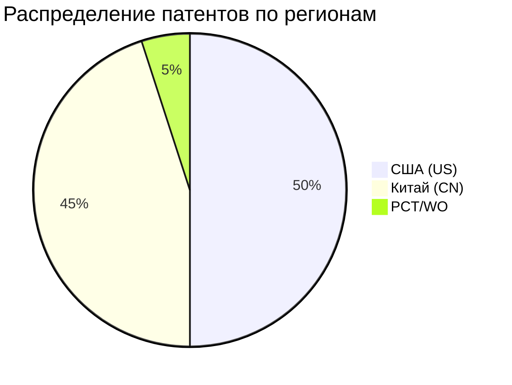

# Анализ патентной активности: беспроводная связь для роботов

Дата: 2025-09-12. Основа: [patents_matrix.md](patents_matrix.md) (40 патентов).

**Глава диссертации:** развёрнутый текст — [chapters/02_patent_search.md](../chapters/02_patent_search.md). Этот файл остаётся рабочей сводкой поиска.

## 1. География патентования

**США:**
- Доминируют **промышленные автоматизаторы** (ABB, Siemens, Fanuc, KUKA, Universal Robots)
- Фокус: QoS, routing, safety, 5G integration, collaborative robots
- Академический сектор: Georgia Tech (swarm control)

**Китай:**
- Доминируют **производители дронов и потребительской робототехники** (DJI, Midea, Huawei)
- Фокус: модульная связь (2G–5G), LoRa + cloud, communication delay в формациях
- Промышленный IoT: LoRa/Wi-Fi платформы для AGV и manipulators

## 2. Динамика по годам (2015–2025)

| Период | Тренд | Ключевые события |
|--------|-------|------------------|
| 2015–2017 | Рост базовых патентов | Swarm control (Georgia Tech), WLAN для пром. роботов (KUKA, Fanuc) |
| 2018–2020 | Взрыв IoT-платформ | LoRa robot (CN), modular comm DJI, ABB resource coordination |
| 2021–2023 | 5G + edge cloud | 5G robotic cell (ICAR), Siemens 5G automation, CN 5G multi-robot |
| 2024–2025 | TSN, QoS, mesh | ABB mobile robot QoS network, mesh reconfigurable robots, Wi-Fi 6 |

**Вывод:** Патентная активность растёт с 2018 года, пик — 2020–2023 (5G rollout + Industry 4.0).

## 3. Технологические кластеры

### Кластер A: Промышленная автоматизация (US/EU)
- **Assignees:** ABB, Siemens, Fanuc, KUKA
- **Технологии:** 5G URLLC, Wi-Fi, deterministic networking
- **Патенты:** US11265798, US12457179, US12218824, US10853084

### Кластер B: Рой / swarm (US/CN)
- **Assignees:** Georgia Tech, DJI, HIT, Tsinghua (via papers)
- **Технологии:** Wireless mesh, communication delay compensation, UWB
- **Патенты:** US10537996, CN110743581, CN111876543

### Кластер C: IoT-платформы (CN)
- **Assignees:** DJI, Midea, IoT startups
- **Технологии:** LoRa + cloud, modular 2G–5G, Wi-Fi bus control
- **Патенты:** CN109048922, CN110799919, CN112015120

### Кластер D: AI + wireless (US/CN)
- **Assignees:** NVIDIA, Huawei, Cobalt Robotics
- **Технологии:** Edge AI inference over wireless, gaze tracking control
- **Патенты:** US10637582, CN111259847

## 4. Белые пятна (research gaps)

| Область | Патентное покрытие | Возможность для исследования |
|---------|-------------------|------------------------------|
| Сравнительный benchmark протоколов | Слабое | Систематическое сравнение BLE/Wi-Fi/ZigBee/LoRa/5G для mechatronics |
| Mixed-criticality protocols | 1 патент (AirTight, не в US/CN matrix) | Протоколы с приоритетами для роя |
| Energy-delay tradeoff | Фрагментарное | Единая модель для выбора протокола |
| Heterogeneous robot swarm | CN focus, мало US | Mechatronics-specific heterogeneous swarms |
| Standard compliance (IEC 62443) | Почти отсутствует | Security-aware wireless robot control |

## 5. Выводы для диссертации

1. **Актуальность подтверждена:** 40+ релевантных патентов за 2015–2025, рост после 2018.
2. **Конкуренция US vs CN:** US — промышленные стандарты и QoS; CN — массовые IoT и UAV.
3. **5G и mesh — доминирующие тренды** в новых заявках (2022–2025).
4. **Научный пробел:** нет патентов/работ с единой сравнительной матрицей всех протоколов для mechatronics — обоснование новизны магистерской.
5. **Практическая значимость:** результаты помогут выбирать протокол под сценарий (single robot vs swarm, indoor vs outdoor, industrial vs research).

## 6. Правовая оговорка

Данный анализ носит **аналитический характер** для научной работы и не заменяет профессиональный FTO (freedom-to-operate) анализ. При коммерческом использовании технологий необходима консультация патентного поверенного.
